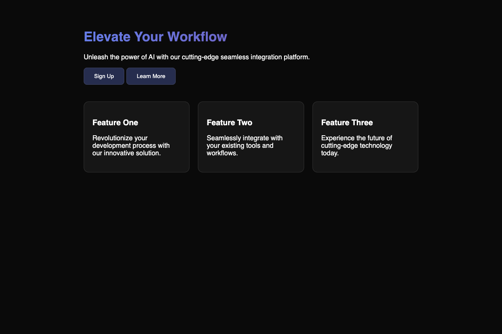
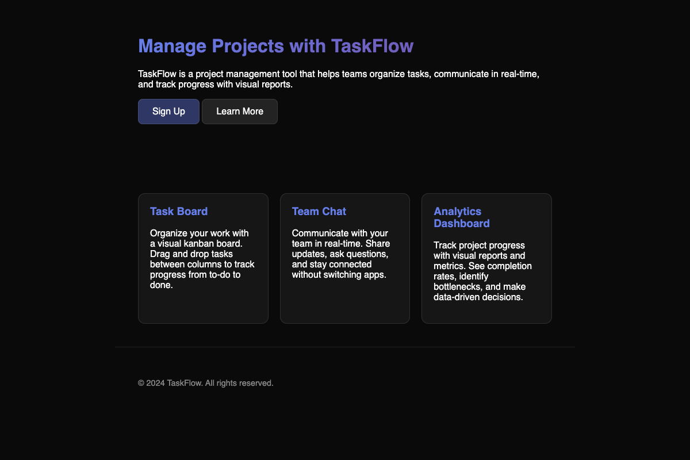

# Kimatropic

> Swarm orchestration for Claude Code -- one conductor, many workers.

Claude (expensive, smart) orchestrates multiple Kimi K2.5 instances (cheap, fast, multimodal) through composable patterns. Instead of one AI doing everything, Kimatropic dispatches parallel swarms of specialized Kimi agents -- 5 orchestration patterns, 13 swarm applications, cross-platform desktop control, visual debugging, and built-in anti-vibe-code detection -- all triggered automatically without you lifting a finger.

## Demo: De-Vibe-Coding a Landing Page

A real example of kimatropic in action. We gave it a typical AI-generated "vibe-coded" landing page and ran two swarm applications:

### Step 1: `/kimi research` -- Vibe-Code Audit (6 parallel Kimi analysts)

The research swarm analyzed the page from multiple angles and returned a structured report:

```json
{
  "vibe_code_score": 92,
  "verdict": "Textbook vibe-coded landing page",
  "score_breakdown": {
    "visual_originality": 10,
    "functional_completeness": 8,
    "content_authenticity": 5,
    "code_quality": 20
  }
}
```

**16 findings** across 4 categories: AI buzzword copy ("Elevate Your Workflow", "Unleash the power of AI"), empty `onclick=""` buttons, inline style soup with copy-pasted glassmorphism, no responsive design, zero accessibility markup.

### Step 2: `/kimi swarm` -- Fix Everything (parallel decomposition, 128 seconds)

The swarm decomposed the 16 fixes into parallel sub-tasks and executed them all:

| Before | After |
|--------|-------|
|  |  |

**What changed:**
- "Elevate Your Workflow" -> "Manage Projects with TaskFlow" (real product name)
- Empty buttons -> working `/signup` route with form + smooth scroll to features
- Copy-pasted inline styles -> clean CSS classes in `<style>` block
- "Feature One/Two/Three" -> "Task Board", "Team Chat", "Analytics Dashboard" with real descriptions
- Added: DOCTYPE, charset, viewport meta, semantic HTML, ARIA labels, hover/focus states, responsive grid, 404 handler, footer

**Total time:** 128 seconds for the swarm to fix all 16 issues. Cost: ~0.5x of a single Opus session.

## Why Kimatropic?

One Opus thought costs roughly the same as ten Kimi executions. Kimatropic exploits that asymmetry: Claude thinks, Kimi does.

| Model | Role | Relative Cost | Strength |
|-------|------|--------------|----------|
| Claude Opus | Conductor | 1x (baseline) | Planning, synthesis, judgment |
| Kimi K2.5 | Worker | ~0.1x | Fast execution, multimodal vision, parallel scale |

A single agent reviewing your design sees one perspective. A swarm of five specialists -- typography, color, layout, components, vibe-code -- sees everything, simultaneously, for less than the cost of one long Opus session. Swarms find more, find it faster, and cost less. The same principle applies to debugging (5 parallel hypotheses), testing (5 angles of coverage), and architecture decisions (5 expert roles debating).

## Quick Start

### Prerequisites

- [Claude Code](https://claude.ai/claude-code) CLI
- [Kimi CLI](https://platform.moonshot.ai/) v1.19+
- git
- jq (`brew install jq` / `apt install jq`)
- GNU coreutils for `timeout` and `tac` (`brew install coreutils` on macOS)
- Python 3 + pyautogui (optional, for desktop control: `pip install pyautogui`)
- ffmpeg (optional, for video recording: `brew install ffmpeg`)

### Installation

```bash
# Clone into your local plugins directory
mkdir -p ~/claude-local-plugins/plugins
git clone https://github.com/brainnotincluded/kimatropic.git ~/claude-local-plugins/plugins/kimatropic
```

### Enable the plugin

Add to `~/.claude/settings.json`:

```json
{
  "enabledPlugins": {
    "kimatropic@local-plugins": true
  }
}
```

### Verify

Run the preflight check to confirm all dependencies are in place:

```bash
~/claude-local-plugins/plugins/kimatropic/scripts/kimi-preflight.sh
```

You should see: `kimi-preflight: all checks passed`

For desktop control features, also run:

```bash
~/claude-local-plugins/plugins/kimatropic/scripts/desktop-preflight.sh
```

## What You Get

### 5 Orchestration Patterns

Composable recipes that define how multiple Kimi instances coordinate. Applications combine these patterns to solve different problems.

| Pattern | How It Works | Best For |
|---------|-------------|----------|
| **LENS ARRAY** | N agents analyze the same input from different expert perspectives; Claude synthesizes | Design review, code review, debugging |
| **ARENA** | N agents solve the same problem independently; Claude picks the best or merges | Implementation where diversity beats templates |
| **GAUNTLET** | Build-attack-fix cycles with adversarial red-teaming between rounds | Hardening user-facing code, security-sensitive features |
| **ASSEMBLY LINE** | Sequential stages, each adding value, with Claude as quality gate between stages | Capture-analyze-generate pipelines |
| **HIVEMIND** | N agents solve identically; agreement = confidence, disagreement = investigate | Bug diagnosis, architecture evaluation, risk assessment |

Patterns compose naturally. For example, Mega Debug uses LENS ARRAY + HIVEMIND: five parallel hypothesis investigators, then consensus scoring to determine confidence.

### 13 Swarm Applications

Each application combines one or more orchestration patterns into a complete workflow.

| Application | Command | What It Does | Patterns |
|------------|---------|-------------|----------|
| Design Intelligence | `/kimi design <url>` | 6-lens visual design analysis (typography, color, layout, components, motion, vibe-code) | ASSEMBLY LINE + LENS ARRAY |
| Mega Debug | `/kimi debug <bug>` | 5 parallel hypotheses investigate a bug, then consensus scoring | LENS ARRAY + HIVEMIND |
| War Room | `/kimi war-room <topic>` | 5 expert roles debate an architecture decision through 3 rounds including steel-manning | HIVEMIND |
| Test Storm | `/kimi test-storm <target>` | 5 agents generate tests from different angles (happy path, edge cases, errors, integration, visual/property) | ARENA + LENS ARRAY |
| Code Gauntlet | `/kimi gauntlet <task>` | Adversarial build-attack-fix cycles until red-team finds no critical issues | GAUNTLET |
| Migration Blitz | `/kimi migrate <spec>` | Parallel multi-file migration in isolated worktrees | LENS ARRAY + ASSEMBLY LINE |
| Reverse Engineering | `/kimi reverse <target>` | 6-lens codebase analysis (data model, auth, API, errors, state, UI) | LENS ARRAY |
| Visual Regression | `/kimi visual-diff` | Semantic before/after comparison that understands layout breaks vs. insignificant pixel changes | LENS ARRAY |
| Responsive Gauntlet | `/kimi responsive <url>` | Continuous resize from 1920px to 320px, then per-breakpoint 5-lens analysis | ASSEMBLY LINE + LENS ARRAY |
| Animation Debugger | `/kimi animation <url>` | 4-lens animation analysis (timing, performance, accessibility, purpose) | LENS ARRAY |
| Cross-App Flow | `/kimi flow-test <script>` | Test workflows that span multiple desktop applications | ASSEMBLY LINE + LENS ARRAY |
| Accessibility Auditor | `/kimi a11y <url>` | 5 capture modes (keyboard-only, high contrast, zoom, reduced motion, extreme widths) with per-mode analysis | LENS ARRAY + GAUNTLET |
| UX Flow Recorder | `/kimi ux <flow>` | Simulated user journey with cognitive load, perceived speed, error recovery, learnability, and emotional design scoring | ASSEMBLY LINE |

### Anti-Vibe-Code Detection

The Code Gauntlet and Design Intelligence applications include a dedicated vibe-code detector that checks for:

- **Dead UI elements** -- buttons and links without real handlers
- **AI placeholder text** -- generic copy like "Elevate your workflow" or "Unlock the power of..."
- **Template defaults** -- unmodified Shadcn/Tailwind components with no design decisions
- **Excessive decoration** -- gratuitous glassomorphism, gradients, and shadows hiding empty functionality
- **Broken responsive** -- layouts that look polished at one viewport and collapse at others
- **Div soup** -- excessive nesting (6+ levels) indicating generated-not-designed structure
- **Missing states** -- no error, loading, or empty state handling
- **Color contrast failures** -- WCAG AA violations masked by fancy gradients

The vibe-code detector outputs a score from 0 (entirely template-generated) to 100 (every element is intentional) with specific evidence for each smell.

### Desktop Control

Cross-platform desktop automation via `desktop-control.py`, enabling Claude to interact with any application on your screen:

- **Click, double-click, right-click** at coordinates
- **Drag** between points with configurable duration
- **Scroll** in four directions
- **Type text** and **press key combinations**
- **Screenshot** full screen or specific regions
- **Record video** via ffmpeg
- **Window management** -- list, focus, and resize windows
- **Flow scripts** -- define multi-step automation sequences in a simple DSL

Works on macOS (via Quartz + AppleScript), Linux (X11), and Windows (GDI). Used by visual applications (Design Intelligence, Responsive Gauntlet, Animation Debugger, etc.) for automated capture.

## Usage

### Auto-Routing (Just Works)

When you enable Kimatropic, a `SessionStart` hook injects a routing table into Claude's context. Claude automatically delegates to the appropriate swarm application without being asked -- no slash commands required.

| When Claude notices... | It automatically uses... |
|----------------------|-------------------------|
| User shares a URL and asks about design/UI | `/kimi design` |
| A bug is hard to find or reproduce | `/kimi debug` |
| Architecture decision with trade-offs | `/kimi war-room` |
| Need to write tests | `/kimi test-storm` |
| Building a user-facing feature | `/kimi gauntlet` |
| Large multi-file refactor | `/kimi migrate` |
| Exploring an unfamiliar codebase | `/kimi reverse` |
| After UI code changes | `/kimi visual-diff` |

Claude never asks "should I use Kimi for this?" -- if a swarm application matches, it fires.

### Manual Delegation

You can also invoke applications explicitly:

```bash
# Swarm applications
/kimi design https://example.com
/kimi debug "Login form submits but nothing happens"
/kimi war-room "Monorepo vs polyrepo for our microservices"
/kimi test-storm src/auth/login.ts
/kimi gauntlet "Build a settings page with theme switching"
/kimi migrate "Convert all class components to hooks in src/components/"
/kimi reverse src/
/kimi visual-diff --before HEAD~3
/kimi responsive https://example.com
/kimi animation https://example.com
/kimi a11y https://example.com

# Simple single-agent delegation
/kimi "Implement the UserProfile component from this spec"
/kimi research "How does the auth middleware chain work?"
/kimi vision "Analyze this mockup and generate the component"
/kimi swarm "Refactor these 8 API endpoints to use the new error format"
```

### Opt-Out

- Say "do this yourself" or "don't use kimi" and Claude handles the work directly.
- Say "just use a single kimi" to skip swarm orchestration and use simple delegation.

### Examples

**Debug a stubborn bug:**
> "The checkout total is wrong when the cart has items with percentage discounts and a flat coupon applied together."

Claude auto-routes to `/kimi debug`. Five Kimi researchers investigate in parallel: one traces the data flow through the discount pipeline, one checks recent git changes to pricing logic, one hunts edge cases in discount stacking, one audits the coupon service dependency, and one examines the UI rendering. Claude compares their findings and reports a high-confidence root cause when three or more agents agree.

**Harden a feature before release:**
> `/kimi gauntlet "Build a file upload component with drag-and-drop, progress bar, retry on failure, and 10MB limit"`

Kimi-A implements the feature. Claude screenshots the result. Kimi-B red-teams: finds the progress bar is fake (vibe-code smell), there is no error state for oversized files, and drag-and-drop silently fails on Firefox. Kimi-C fixes all findings. Kimi-D red-teams again and finds no critical issues. Done in three rounds.

**Explore a new codebase:**
> "I just cloned this repo and need to understand how it works."

Claude auto-routes to `/kimi reverse`. Six Kimi researchers analyze in parallel: data model, auth and security, API surface, error handling, state management, and UI/UX mapping. Claude synthesizes their findings into a comprehensive architecture document with entry points and dependency diagrams.

**Make an architecture decision:**
> "Should we use WebSockets or SSE for our real-time notifications?"

Claude auto-routes to `/kimi war-room`. Five experts (security, performance, UX, maintenance, domain) each state their position. In round 2, each expert steel-mans their least-preferred option. In round 3, they give final recommendations. Claude produces an Architecture Decision Record with the consensus, dissenting opinions, and accepted trade-offs.

## Architecture

```
                         +--------------------------+
                         |      Claude (Opus)       |
                         |   Conductor / Planner    |
                         +-----------+--------------+
                                     |
                    +----------------+----------------+
                    |                                 |
            Auto-Routing                        /kimi Commands
           (SessionStart hook)                (SKILL.md dispatch)
                    |                                 |
                    +----------------+----------------+
                                     |
                   +-----------------+-----------------+
                   |     Applications Layer (13)       |
                   |  design, debug, war-room, ...     |
                   +-----------------+-----------------+
                                     |
                   +-----------------+-----------------+
                   |     Orchestration Patterns (5)    |
                   | LENS ARRAY, ARENA, GAUNTLET,      |
                   | ASSEMBLY LINE, HIVEMIND            |
                   +-----------------+-----------------+
                                     |
         +------------+-----------+--+--+-----------+------------+
         |            |           |     |           |            |
    kimi-impl    kimi-research  kimi-vision  kimi-swarm   kimi-council
         |            |           |     |           |            |
         +------------+-----------+--+--+-----------+------------+
                                     |
                   +-----------------+-----------------+
                   |     Capabilities Layer            |
                   | kimi-run.sh   desktop-control.py  |
                   | screen-capture.sh  preflight.sh   |
                   +-----------------------------------+
```

**Capabilities** (bottom) provide the raw tools: running Kimi CLI sessions, capturing screenshots, controlling the desktop, checking dependencies.

**Orchestration Patterns** (middle) define how to coordinate multiple Kimi instances: fan out, sequence, compete, attack, or vote.

**Applications** (top) combine patterns into complete workflows for specific tasks, with prompt templates, stage definitions, and synthesis instructions.

Claude reads the application definition, follows the pattern instructions, dispatches agents, collects results, and synthesizes the final output.

## Configuration

Copy `CLAUDE.md.example` to your project's `CLAUDE.md` to customize auto-routing behavior:

```bash
cp ~/claude-local-plugins/plugins/kimatropic/CLAUDE.md.example ./CLAUDE.md
```

The example file defines which situations trigger which swarm applications, when to keep work on Opus, failure escalation rules, and parallel execution strategies. Edit it to match your project's needs -- for example, you might want to always run `/kimi gauntlet` for any PR touching user-facing code, or disable auto-routing for certain directories.

### Key Configuration Points

- **Auto-routing rules:** Which situations trigger which swarm applications
- **Opus-only tasks:** Ambiguous requirements, security-sensitive review, cross-cutting concerns
- **Failure escalation:** Retry once with more context, then Opus takes over
- **Parallel execution:** Use `--branch` for worktree isolation when dispatching concurrent tasks

## Contributing

See [CONTRIBUTING.md](CONTRIBUTING.md) for guidelines on adding new orchestration patterns, swarm applications, and agents.

## License

[MIT](LICENSE)
